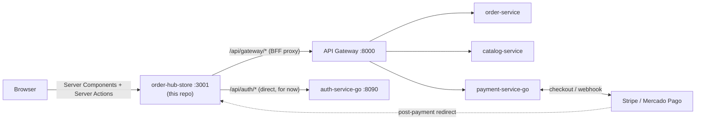

# order-hub-store

🇧🇷 [Português](README.md) | 🇬🇧 English


[](https://github.com/Adriano-silva131/order-hub)
[](LICENSE)

Storefront for **[OrderHub](https://github.com/Adriano-silva131/order-hub)**, built with Next.js (App Router) — the client that consumes the platform's microservices. Covers the full purchase flow: catalog, cart, passwordless login (email + code, or Google), checkout with address/delivery, and real payment via Stripe/Mercado Pago Checkout Sessions.

## About OrderHub

This project is the frontend piece of **[OrderHub](https://github.com/Adriano-silva131/order-hub)**, an event-driven e-commerce platform built as a portfolio project: an API Gateway in front of independently deployable services (order, catalog, payment, notification) communicating over Kafka, its own auth service in Go ([auth-service-go](https://github.com/Adriano-silva131/auth-service-go)), and a full observability stack (Prometheus, Grafana, Tempo, Loki). This repository is the platform's only real client — until now, the other services were only exercised via Swagger/curl.



## What this project demonstrates

- **Real feature-based architecture**, not just in name: every domain (`cart`, `catalog`, `auth`, `checkout`, `orders`, `payments`) is a self-contained module with a single entry point (`index.ts`) — the boundary is enforced by an ESLint rule (`no-restricted-imports`), not just documented convention.
- **Structurally validated Server Actions**: migrated to [`next-safe-action`](https://next-safe-action.dev), so a new action can't skip input validation — a schema is required before the handler even exists.
- **BFF pattern**: the browser never talks to backend services directly. Tokens live in `httpOnly` cookies; client calls go through a same-origin proxy (`/api/gateway/[...path]`) that attaches the session server-side.
- **Security treated as part of development**, not a separate pass: cart price/name are never trusted from a client-supplied payload (the schema drops any field beyond `productId`/`quantity`); the checkout URL returned by the payment gateway is validated (schema + `https`) before any redirect; an open-redirect bug in the login/OAuth flow (a protocol-relative-URL bypass of a naive `startsWith("/")` check) was caught in review and fixed before shipping.
- **Real payment flow**, not simulated: `payment-service-go` creates an actual Stripe/Mercado Pago checkout session; the customer is redirected there and only returns after paying (or cancelling).

## Architecture

```
src/
  app/              Next.js routes (App Router) — composition only, no domain logic
    (store)/        home, catalog, login
    checkout/       identification → delivery → payment → success/cancel
    api/             BFF: proxy to the API Gateway, Google OAuth callback
    layouts/         navbar, global providers
  features/
    catalog/        product listing and search
    cart/            client-only cart (Zustand + persist)
    auth/            email+code login and Google OAuth
    checkout/        delivery/payment steps, address form
    orders/          order creation
    payments/        payment checkout (Stripe/Mercado Pago)
  shared/
    ui/              primitives with no business knowledge (Button, Input, Countdown...)
    lib/             http client, backend client (BFF), redirect validation
    config/          environment variables (validated with zod)
  proxy.ts           route gate (Next Proxy — middleware's successor)
```

Every feature follows the same skeleton: `schemas.ts` (Zod, single source of validation and type), `api/`, `hooks/`, `components/`, and a lean `index.ts` — exporting only what's actually consumed from outside.

## Purchase flow

1. **Catalog** (`/catalogo`) — SSR prefetch + TanStack Query hydration; search filtering happens client-side (`catalog-service` has no search endpoint yet).
2. **Cart** — client-only (Zustand), browsing and adding to cart fully logged out.
3. **Identification** — only shows up as checkout's first step (or at `/login`, outside it): email + 6-digit code, or "Continue with Google".
4. **Delivery** — address capture (not persisted yet — no user profile exists to store it against).
5. **Payment** — `POST /api/v1/orders` creates the real order; `payment-service-go` opens the checkout session; the browser is redirected to Stripe/Mercado Pago.
6. **Confirmation** — return to `/checkout/success` or `/checkout/cancel`, depending on the outcome.

## Running locally

Requires the rest of the platform running — [`order-hub`](https://github.com/Adriano-silva131/order-hub) (API Gateway + order/catalog/payment services + infra) and [`auth-service-go`](https://github.com/Adriano-silva131/auth-service-go), each with its own `docker compose up -d --build`.

```bash
npm install
cp .env.example .env.local   # point AUTH_SERVICE_URL/API_GATEWAY_URL if they differ from local defaults
npm run dev
```

The app runs on `http://localhost:3001` (fixed port — it's the one registered as the Google OAuth redirect URI).

## Library choices

| Need | Library | Why |
|---|---|---|
| Framework | Next.js 16 (App Router) | Server Components, Server Actions, and the BFF (`/api/*`) in the same process as the frontend |
| Server Action validation | `next-safe-action` | schema required by construction, typed result (`data`/`serverError`/`validationErrors`) |
| Server state | `@tanstack/react-query` | caching, invalidation, SSR→client hydration |
| Client state | `zustand` + `persist` | cart, no context/prop-drilling needed |
| Schema/validation | `zod` | single source for validation and type inference, on both sides (client and Server Action) |
| Forms | `react-hook-form` + `@hookform/resolvers` | direct integration with the Zod schema |
| Styling | Tailwind CSS v4 | design-system tokens via `@theme inline` |

## Related repositories

| Repo | Stack | Role |
|---|---|---|
| [order-hub](https://github.com/Adriano-silva131/order-hub) | Java 21 / Spring Boot | Main platform: API Gateway, order/catalog/notification services, infra |
| [auth-service-go](https://github.com/Adriano-silva131/auth-service-go) | Go | Authentication (email+code, Google OAuth, JWT RS256 + JWKS) |
| [payment-service-go](https://github.com/Adriano-silva131/payment-service-go) | Go | Payments — Stripe / Mercado Pago checkout and webhooks |
| **order-hub-store** (this repository) | Next.js / TypeScript | Frontend — the platform's only real client |

## License

Distributed under the [MIT license](LICENSE).
