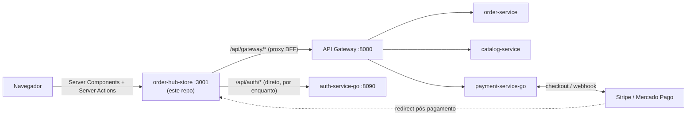

# order-hub-store

🇧🇷 Português | 🇬🇧 [English](README.en.md)


[](https://github.com/Adriano-silva131/order-hub)
[](LICENSE)

Loja do **[OrderHub](https://github.com/Adriano-silva131/order-hub)**, em Next.js (App Router) — o cliente que consome os microsserviços da plataforma. Cobre o fluxo de compra completo: catálogo, carrinho, login sem senha (e-mail + código, ou Google), checkout com endereço/entrega e pagamento real via Stripe/Mercado Pago Checkout Sessions.

## Sobre o OrderHub

Este projeto é a peça de frontend do **[OrderHub](https://github.com/Adriano-silva131/order-hub)**, uma plataforma de e-commerce orientada a eventos construída como projeto de portfólio: um API Gateway na frente de serviços independentemente implantáveis (order, catalog, payment, notification) que se comunicam via Kafka, autenticação própria em Go ([auth-service-go](https://github.com/Adriano-silva131/auth-service-go)), e uma stack completa de observabilidade (Prometheus, Grafana, Tempo, Loki). Este repositório é o único cliente real da plataforma — os outros serviços, até aqui, só eram exercitados via Swagger/curl.



## O que este projeto demonstra

- **Arquitetura feature-based real**, não só no nome: cada domínio (`cart`, `catalog`, `auth`, `checkout`, `orders`, `payments`) é um módulo autocontido com uma única porta de entrada (`index.ts`) — a fronteira é imposta por uma regra de ESLint (`no-restricted-imports`), não só por convenção documentada.
- **Server Actions com validação estrutural**: migradas para [`next-safe-action`](https://next-safe-action.dev), então uma action nova não tem como esquecer de validar o input — o schema é obrigatório antes do handler existir.
- **Padrão BFF**: o navegador nunca fala direto com os serviços do backend. Tokens vivem em cookies `httpOnly`; chamadas do client passam por um proxy same-origin (`/api/gateway/[...path]`) que anexa a sessão do lado do servidor.
- **Segurança tratada como parte do desenvolvimento**, não como um passo à parte: preço e nome do produto no carrinho nunca são confiados num payload vindo do cliente (o schema descarta qualquer campo além de `productId`/`quantity`); a URL de checkout devolvida pelo gateway de pagamento é validada (schema + `https`) antes de qualquer redirect; um bug de open redirect no fluxo de login/OAuth (bypass de `startsWith("/")` via URL protocol-relative) foi encontrado em revisão e corrigido antes de ir pra produção.
- **Fluxo de pagamento real**, não simulado: `payment-service-go` cria a sessão de checkout de verdade na Stripe/Mercado Pago; o cliente é redirecionado pra lá e só volta depois do pagamento (ou cancelamento).

## Arquitetura

```
src/
  app/              rotas do Next.js (App Router) — só composição, sem lógica de domínio
    (store)/        home, catálogo, login
    checkout/       identificação → entrega → pagamento → sucesso/cancelamento
    api/             BFF: proxy pro API Gateway, callback do Google OAuth
    layouts/         navbar, providers globais
  features/
    catalog/        listagem e busca de produtos
    cart/            carrinho client-only (Zustand + persist)
    auth/            login por e-mail+código e Google OAuth
    checkout/        passos de entrega/pagamento, formulário de endereço
    orders/          criação de pedido
    payments/        checkout de pagamento (Stripe/Mercado Pago)
  shared/
    ui/              primitivos sem conhecimento de negócio (Button, Input, Countdown...)
    lib/             http client, cliente do backend (BFF), validação de redirect
    config/          variáveis de ambiente (validadas com zod)
  proxy.ts           gate de rota (Next Proxy — sucessor do middleware)
```

Cada feature segue o mesmo esqueleto: `schemas.ts` (Zod, fonte única de validação e tipo), `api/`, `hooks/`, `components/`, e um `index.ts` enxuto — só exporta o que é de fato consumido de fora.

## Fluxo de compra

1. **Catálogo** (`/catalogo`) — SSR com prefetch + hidratação do TanStack Query; busca filtrada no client (o `catalog-service` ainda não tem endpoint de busca).
2. **Carrinho** — client-only (Zustand), navegação e adição ao carrinho 100% deslogadas.
3. **Identificação** — só aparece no primeiro passo do checkout (ou em `/login`, fora dele): e-mail + código de 6 dígitos, ou "Continuar com Google".
4. **Entrega** — captura de endereço (sem persistência ainda — nenhum perfil de usuário existe pra guardar isso).
5. **Pagamento** — `POST /api/v1/orders` cria o pedido real; `payment-service-go` abre a sessão de checkout; o navegador é redirecionado pra Stripe/Mercado Pago.
6. **Confirmação** — retorno para `/checkout/success` ou `/checkout/cancel`, conforme o resultado.

## Rodando localmente

Requer o restante da plataforma no ar — [`order-hub`](https://github.com/Adriano-silva131/order-hub) (API Gateway + order/catalog/payment services + infra) e [`auth-service-go`](https://github.com/Adriano-silva131/auth-service-go), cada um com seu próprio `docker compose up -d --build`.

```bash
npm install
cp .env.example .env.local   # aponte AUTH_SERVICE_URL/API_GATEWAY_URL se não forem os padrões locais
npm run dev
```

O app sobe em `http://localhost:3001` (porta fixa — é a que está registrada como redirect URI do Google OAuth).

## Escolhas de bibliotecas

| Necessidade | Biblioteca | Por quê |
|---|---|---|
| Framework | Next.js 16 (App Router) | Server Components, Server Actions, e o BFF (`/api/*`) no mesmo processo do front |
| Validação de Server Actions | `next-safe-action` | schema obrigatório por construção, resultado tipado (`data`/`serverError`/`validationErrors`) |
| Estado do servidor | `@tanstack/react-query` | cache, invalidação, hidratação SSR→client |
| Estado do cliente | `zustand` + `persist` | carrinho, sem depender de contexto/prop drilling |
| Schema/validação | `zod` | fonte única pra validação e inferência de tipo, nos dois lados (client e Server Action) |
| Formulários | `react-hook-form` + `@hookform/resolvers` | integração direta com schema Zod |
| Estilo | Tailwind CSS v4 | tokens do design system via `@theme inline` |

## Repositórios relacionados

| Repo | Stack | Papel |
|---|---|---|
| [order-hub](https://github.com/Adriano-silva131/order-hub) | Java 21 / Spring Boot | Plataforma principal: API Gateway, order/catalog/notification services, infra |
| [auth-service-go](https://github.com/Adriano-silva131/auth-service-go) | Go | Autenticação (e-mail+código, Google OAuth, JWT RS256 + JWKS) |
| [payment-service-go](https://github.com/Adriano-silva131/payment-service-go) | Go | Pagamento — checkout e webhooks Stripe / Mercado Pago |
| **order-hub-store** (este repositório) | Next.js / TypeScript | Frontend — único cliente real da plataforma |

## Licença

Distribuído sob a [licença MIT](LICENSE).
